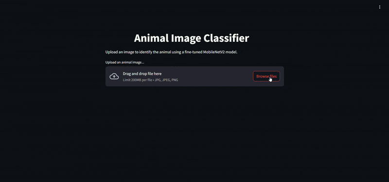

# Animal Image Classifier

A deep learning-powered web application that classifies animal images into 15 categories using a fine-tuned MobileNetV2 model. This project demonstrates the practical use of transfer learning for computer vision tasks and is deployed with a lightweight Streamlit interface.

## Project Overview
This project leverages MobileNetV2, a pre-trained convolutional neural network, fine-tuned on a custom animal dataset. It provides real-time predictions via an intuitive web interface, built with Streamlit and deployable on platforms like Hugging Face Spaces.

## Supported Classes
- Bear
- Bird 
- Cat
- Cow
- Deer 
- Dog
- Dolphin
- Elephant
- Giraffe
- Horse
- Kangaroo
- Lion
- Panda
- Tiger
- Zebra

## Tech Stack
- **Model Architecture**: MobileNetV2 (Transfer Learning)
- **Frameworks**: TensorFlow, Keras
- **Frontend**: Streamlit
- **Deployment**: Hugging Face Spaces 

## Features
- Upload `.jpg`, `.jpeg`, or `.png` images.
- Real-time predictions with top-3 results.
- Grad-CAM heatmap visualizations for model interpretability.
- Bar chart of class confidence scores.
- Clean UI with error handling and confidence alerts.

## Project Structure

```
animal-image-classification/
├──Dataset                         # Folder containing 15 categories of animal images access it on [Frough11/animal_dataset](https://huggingface.co/datasets/Frough11/animal_dataset)
├── app.py                         # Streamlit application
├── efficientnetb0_best.h5         # Pretrained model (EfficientNetB0)[Frough11/animal-classifier](https://huggingface.co/Frough11/animal-classifier)
├── ml animal classification.ipynb # Training notebook
├── requirements.txt               # Dependencies
├── Image Classification of animals.pdf  # Project summary
└── README.md                      # Project documentation
```


## ⚙️ Getting Started

### Run Locally

```bash
git clone https://github.com/your-username/animal-image-classifier.git
cd animal-image-classifier
pip install -r requirements.txt
streamlit run app.py
```

## Project Demo



### Deploy Online
You can deploy this app to Hugging Face Spaces by uploading the same files and selecting the Streamlit SDK.

## Acknowledgements
- MobileNetV2 architecture from TensorFlow Keras Applications.
- Grad-CAM methodology for CNN interpretability.
- Hugging Face Spaces for free app hosting.

---

📌 *This project was developed as part of a machine learning portfolio to showcase image classification using transfer learning and interactive visual explanations.*
